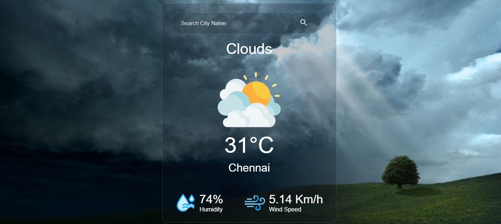

# Weather-Dashboard
---

# Weather App

This is a simple weather application that allows users to check real-time weather information for a specific city. It fetches data from the OpenWeatherMap API and provides key details such as temperature, humidity, wind speed, and dynamic background and weather icons based on the current weather.

## Features
- **Search for City Weather**: Allows users to search for weather data by entering a city name.
- **Dynamic UI**: Displays temperature, humidity, and wind speed.
- **Background & Icons Change**: The background and weather icon update dynamically based on the weather condition (e.g., clear sky, rain, snow).
- **Error Handling**: Displays an error message when an invalid city name is entered.
- **Responsive Design**: Works smoothly on different screen sizes, including mobile and desktop.
## Screenshot

--

## Technologies Used
- **HTML**: Structure of the app.
- **CSS**: Styling the app’s UI components.
- **JavaScript**: Fetching weather data from the OpenWeatherMap API and dynamically updating the UI.

## Requirements
- **API Key** from OpenWeatherMap (You can get your API key [here](https://openweathermap.org/api)).
- **Internet connection** to fetch real-time weather data from the API.

## Setup Instructions

### 1. Get an API Key
To access weather data, you will need an API key from OpenWeatherMap.

1. Go to [OpenWeatherMap](https://openweathermap.org/api) and sign up.
2. Obtain your **API Key**.

### 2. Modify the `apiKey` in the JavaScript File
Open your `script.js` file and update the `apiKey` variable with your personal OpenWeatherMap API key.

```javascript
const apiKey = "YOUR_API_KEY_HERE";
```

### 3. File Overview
This project contains the following files:
- **index.html**: Contains the HTML structure for the weather app, including the search input, weather details, and error message display.
- **style.css**: Styles the app, including layout, fonts, and UI elements.
- **script.js**: Handles fetching data from OpenWeatherMap API and updating the UI with dynamic weather details.

### 4. How to Run
1. Clone or download the repository.
2. Open `index.html` in a browser to start using the app.

### 5. Usage
- Type a city name in the search input and press **Enter** or click the search button.
- The weather details for the entered city will be displayed, including temperature, humidity, and wind speed.
- The background image and weather icon will change based on the weather conditions (e.g., rain, clear skies, snow).

---

## File Descriptions

### `index.html`
This file contains the structure of the weather app:
- A **search input** field where users can type a city name.
- A **search button** to trigger the weather data fetch.
- An **error message** section that appears when an invalid city name is entered.
- A **weather display section** that shows the city name, temperature, humidity, wind speed, and a dynamic weather icon.
- A **Use My Location button** for fetching weather using geolocation.

### `style.css`
This file contains the CSS rules for styling the weather app:
- The app has a responsive design and uses the **Charmonman** font for the text.
- The background image dynamically changes based on weather conditions.
- Icons for humidity, wind speed, and weather conditions are styled accordingly.

### `script.js`
This JavaScript file handles fetching weather data from the OpenWeatherMap API:
- The `updateWeather()` function fetches weather details based on the city name entered.
- The UI updates dynamically with relevant weather information, including background and icon changes based on the weather condition.
- **Geolocation support**: Fetches weather for the user's current location if they allow location access.
- Includes error handling for invalid city names.

---

## Example

**Enter City**: *Chennai*  
**Output**:  
- City: Chennai  
- Temperature: 32°C  
- Humidity: 50%  
- Wind Speed: 20 Km/h  
- Weather Icon: *Rain* (with a background of rainy weather)

---


